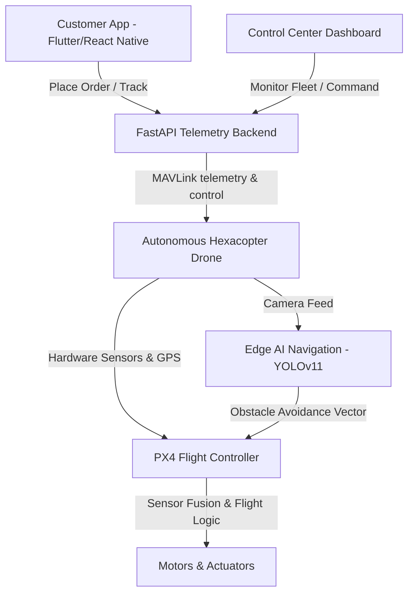
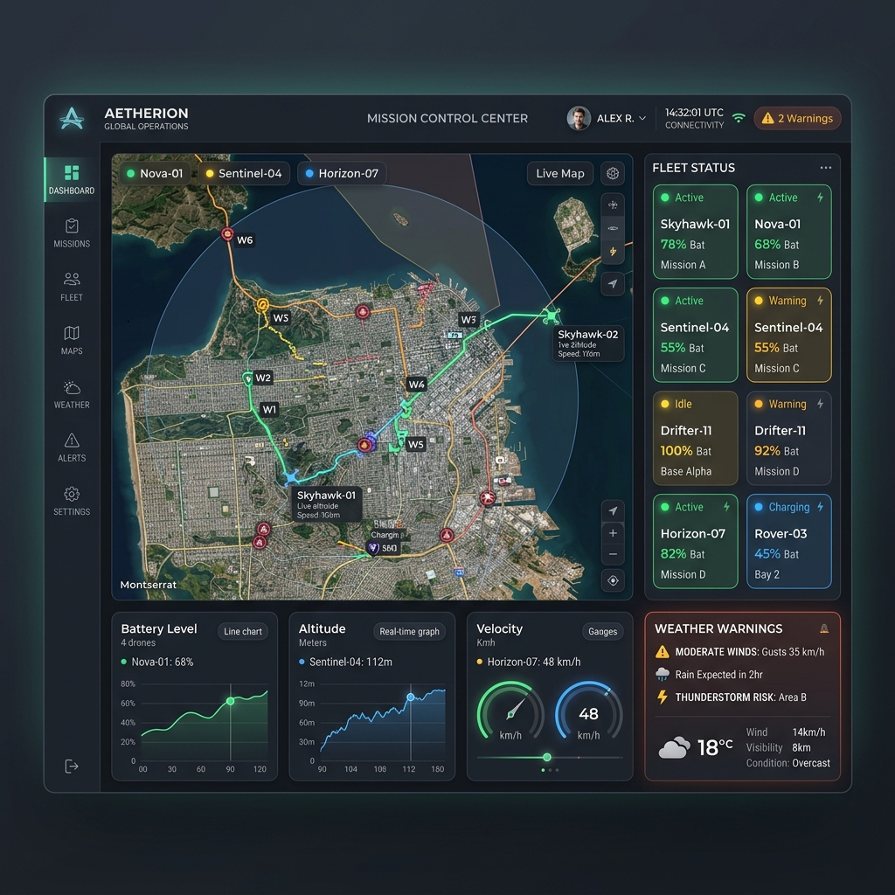
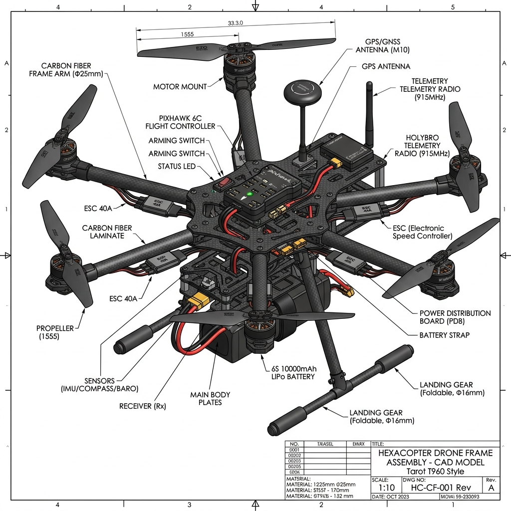

# 🛸 DAD - Direct Aerial Delivery


**Direct Aerial Delivery (DAD)** is an advanced, enterprise-grade autonomous drone logistics platform designed for smart city delivery systems and medical/rapid-response payload transport. The system combines modern drone hardware firmware, computer vision AI networks, cloud telemetry backend servers, and a premium control dashboard to enable safe, scalable, and fully autonomous flight operations.

---

## 🏢 Platform Ecosystem Overview

The DAD ecosystem consists of six main integrated components:



1. **Drone Firmware (`firmware/`)**: Real-time onboard flight algorithms built on top of PX4 and ArduPilot using MAVLink. Includes custom modules for active battery management, emergency power-hub landing, and lidar-based terrain verification.
2. **AI Navigation (`ai/`)**: Computer Vision pipeline deploying **YOLOv11** for low-latency obstacle detection (birds, power lines, towers, trees) and a deep CNN for real-time weather classification.
3. **Cloud Telemetry Backend (`backend/`)**: FastAPI-based microservice architecture managing real-time MQTT/Websocket telemetry streams, database schemas, dynamic mission generation, and order dispatching.
4. **Control Center Dashboard (`dashboard/`)**: Premium dark-mode glassmorphic telemetry dashboard displaying real-time 3D flight trajectories, fleet battery state-of-health, weather alerts, and control overrides.
5. **Customer Mobile Application (`mobile/`)**: React Native customer app with OTP authorization, package dimension scanning, live parcel tracking, and contactless drop-off verification.
6. **Simulation Environment (`simulations/`)**: Software In The Loop (SITL) Gazebo and AirSim simulation configs to test obstacle avoidance in heavy rain, high-wind, and urban canyon environments.

---

## 🚀 Key Features

*   **Autonomous BVLOS Navigation**: Beyond Visual Line of Sight flight planning using RTK-GPS and onboard route correction.
*   **Sensor Fusion AI**: Camera + LiDAR + GPS + IMU data integration for 360° obstacle awareness.
*   **Weather-Adaptive Flight Modes**: Intelligent rerouting or emergency landing procedures triggered by CNN weather detection.
*   **Failsafe Return-to-Home (RTH)**: Dynamic battery calculation that identifies the nearest available landing hub based on wind vectors and remaining power capacity.
*   **Military-Grade Security**: Secure MAVLink telemetry streams with AES-256 encryption and JWT control channel handshakes.

---

## 🏗️ Repository Architecture

```
DAD/
├── README.md                # Project landing page
├── LICENSE                  # MIT License
├── CONTRIBUTING.md          # Open-source contributions guidelines
├── CHANGELOG.md             # Version control log
├── ROADMAP.md               # Milestones & features timeline
├── CITATION.cff             # Academic citing scheme
│
├── docs/                    # Architectural specs, API guides & user stories
├── architecture/            # Mermaid specifications and visual flows
├── research/                # Whitepapers on DGCA compliance, BVLOS, and LiDAR fusion
│
├── firmware/                # PX4 C++ battery managers & MAVLink scripts
├── ai/                      # YOLOv11 detectors & EfficientNet weather models
├── backend/                 # FastAPI server, WebSockets telemetry, database schemas
├── dashboard/               # Next.js/HTML control panel with mock canvas flight map
├── mobile/                  # React Native client app interface
│
├── simulations/             # SITL Gazebo script environments & urban scenarios
├── hardware/                # CAD models, PCB designs, and Bill of Materials
├── security/                # Threat models, JWT encryption & hijack prevention
└── testing/                 # Integration tests & Python unit tests
```

---

## ⚙️ Quick Start

### 1. Backend Server Setup
```bash
cd backend
python -m venv venv
source venv/bin/activate  # On Windows: venv\Scripts\activate
pip install -r requirements.txt
python main.py
```
*Access API Docs at: `http://localhost:8000/docs`*

### 2. Control Dashboard
Simply open `dashboard/index.html` in your web browser, or serve it:
```bash
cd dashboard
python -m http.server 8080
```
*View dashboard at: `http://localhost:8080`*

### 3. AI Navigation Pipeline
```bash
cd ai/vision
python obstacle_detector.py --input test_stream.mp4
```

---

## 📊 Technical R&D Highlight

| Component | Technical Stack | Purpose / Action |
| :--- | :--- | :--- |
| **Drone Autopilot** | PX4 Autopilot, C++, PX4-SITL | Real-time flight control, actuator output |
| **AI Detection** | YOLOv11, PyTorch, TensorRT | 30 FPS edge object detection (wires, birds) |
| **Backend API** | FastAPI, SQLite, Pydantic | Fleet tracking database, geojson routing |
| **Control UI** | HSL CSS, HTML5 Canvas, JS WebSockets | Real-time low-latency visualization |

---

## 📸 System Showcase

### Control Center Dashboard


### Drone CAD Render


---

## 📜 License & Citation

This project is licensed under the MIT License - see the [LICENSE](LICENSE) file for details.

If you use this system for academic or industry research, please cite:
```bibtex
@software{DAD_Drone_2026,
  author = {Direct Aerial Delivery Systems},
  title = {DAD: Autonomous Last-Mile Drone Delivery & Control Ecosystem},
  year = {2026},
  url = {https://github.com/438malludiswardhanreddy-sketch/DAD-Direct-Aerial-Delivery}
}
```
