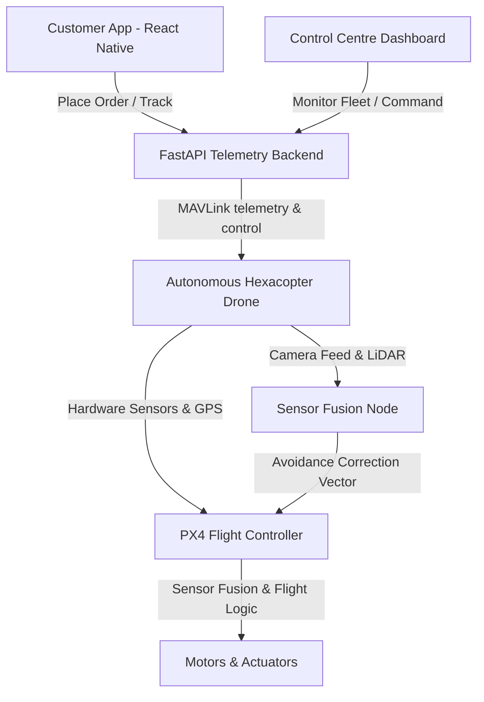
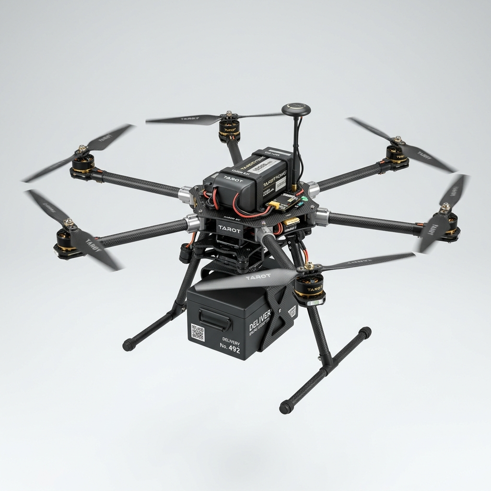

# 🛸 DAD - Direct Aerial Delivery

[](#)
[](#)
[](#)
[](#)
[](#)
[](#)


## 📖 Project Brief
**Direct Aerial Delivery (DAD)** is a final year undergraduate engineering design project and research platform focusing on autonomous drone-based logistics and last-mile aerial delivery systems. Developed as an undergraduate engineering research and development project, this project implements a complete, integrated system-level R&D prototype that bridges drone firmware logic, local sensor fusion, companion computer routing, cloud telemetry ingestion, and client booking.

---

## 🏢 Platform Ecosystem Overview

The DAD ecosystem consists of six main integrated components:



1. **Drone Firmware (`firmware/`)**: Real-time onboard flight algorithms built on top of PX4 and ArduPilot using MAVLink. Includes custom modules for active battery management, emergency power-hub landing, and lidar-based terrain verification.
2. **Sensor Fusion & Autonomous Control (`sensor_fusion/` and `autonomous/`)**: Multi-sensor integration combining rangefinder readings with camera detections to calculate safe clearance ranges and handle meteorological failsafes.
3. **Cloud Telemetry Backend (`backend/`)**: FastAPI-based microservice architecture managing real-time MQTT/Websocket telemetry streams, database schemas, dynamic mission generation, and order dispatching.
4. **Control Centre Dashboard (`dashboard/`)**: Premium dark-mode glassmorphic telemetry dashboard displaying real-time 3D flight trajectories, fleet battery state-of-health, weather alerts, and control overrides.
5. **Customer Mobile Application (`mobile/`)**: React Native customer app with OTP authorisation, package dimension scanning, live parcel tracking, and contactless drop-off verification.
6. **Simulation Environment (`simulations/`)**: Software In The Loop (SITL) Gazebo and AirSim simulation configs to test obstacle avoidance in heavy rain, high-wind, and urban canyon environments.

---

## 🚀 Key Features

*   **Autonomous BVLOS Navigation**: Beyond Visual Line of Sight flight planning using RTK-GPS and onboard route correction.
*   **Sensor Fusion Analysis**: Camera + LiDAR + GPS + IMU data integration for 360° obstacle awareness.
*   **Weather-Adaptive Flight Modes**: Intelligent rerouting or emergency landing procedures triggered by sensor weather detection.
*   **Failsafe Return-to-Home (RTH)**: Dynamic battery calculation that identifies the nearest available landing hub based on wind vectors and remaining power capacity.
*   **Secure Telemetry Framework**: Secure MAVLink telemetry streams with signature signing and JWT control channel verification.

---

## 📊 Project Status

**Current Phase: Architecture & Prototype Development**

### Completed
*   Repository Architecture & Folder Setup
*   System Architecture Design
*   Initial Documentation & Academic Research Papers

### In Progress
*   Sensor Fusion & Kalman Filter Modules
*   FastAPI Backend Telemetry API
*   PX4 Integration Control Bindings
*   Simulation Scenarios in Gazebo

### Planned
*   Physical Hardware Tarot 680Pro Assembly
*   Field Testing & Calibration In Solapur Region
*   Control Centre Live WebSocket Integration
*   Contactless Mobile Client Verification

---

## 🗺️ Project Roadmap

*   **Phase 1 – Research & Architecture**: Complete literature survey, regulatory review, and system specification blocks.
*   **Phase 2 – PX4 + Gazebo Simulation**: Connect PX4 SITL and configure the urban delivery environment simulation.
*   **Phase 3 – Sensor Fusion Integration**: Deploy camera detection bounding box matching with LiDAR rangefinders.
*   **Phase 4 – Backend & Telemetry**: Build FastAPI endpoints, telemetry schemas, and database loggers.
*   **Phase 5 – Mobile Application**: Create React Native client screens and live location tracking cards.
*   **Phase 6 – Hardware Prototype**: Assemble Tarot 680Pro carbon hexacopter frame with Pixhawk 6C.
*   **Phase 7 – Field Validation**: Conduct line-of-sight flight operations to test sensor override loops.
*   **Phase 8 – Production MVP**: Conduct controlled pilot validation in a designated testing environment subject to regulatory approvals.

---

## 🏗️ Repository Architecture

```
DAD/
├── README.md                # Project landing page (Indian English)
├── LICENSE                  # MIT License
├── CONTRIBUTING.md          # Open-source contributions guidelines
├── CHANGELOG.md             # Version control log
├── ROADMAP.md               # Milestones & features timeline
├── CITATION.cff             # Academic citing scheme
│
├── docs/                    # Project overview & requirements spec
├── architecture/            # System & Software diagrams (.png & .mermaid)
├── research/                # Literature surveys and regulatory reviews (Indian English)
│
├── firmware/                # PX4 C++ battery managers & MAVLink scripts
├── sensor_fusion/           # LiDAR + Vision match nodes & Kalman filters
├── autonomous/              # Obstacle avoidance vectors & weather monitor fail-safes
├── backend/                 # FastAPI server, WebSockets telemetry, database schemas
├── dashboard/               # Next.js/HTML control panel with mock canvas flight map
├── mobile/                  # React Native client app interface
│
├── simulations/             # SITL Gazebo script environments & urban scenarios
├── hardware/                # CAD models, PCB designs, and Bill of Materials
├── security/                # Threat models, JWT encryption & hijack prevention
└── testing/                 # Integration tests & Python unit tests
```

---

## 📸 System Showcase & Visual Evidence

### System Architecture


### Software Architecture


### Deployment Architecture


### Control Centre Dashboard Demo


### Drone CAD Render


### Flight Simulation Screenshot


---

## ⚙️ Quick Start

### 1. Backend Server Setup
```bash
cd backend
python -m venv venv
source venv/bin/activate  # On Windows: venv\Scripts\activate
pip install -r requirements.txt
python main.py
```
*Access API Docs at: `http://localhost:8000/docs`*

### 2. Control Dashboard
Simply open `dashboard/index.html` in your web browser, or serve it:
```bash
cd dashboard
python -m http.server 8080
```
*View dashboard at: `http://localhost:8080`*

### 3. Sensor Fusion Tests
```bash
python -m unittest testing/test_suite.py
```

---

## 📜 Licence & Citation

This project is licensed under the MIT Licence - see the [LICENSE](LICENSE) file for details.

If you use this system for academic or industry research, please cite:
```bibtex
@thesis{DAD_Drone_2026,
  author = {DAD Project Group},
  title = {Direct Aerial Delivery: Autonomous Last-Mile Drone Delivery & Control Ecosystem},
  school = {Solapur University, Department of Electronics and Telecommunication Engineering},
  year = {2026},
  type = {Final Year B.E. Project Report}
}
```
