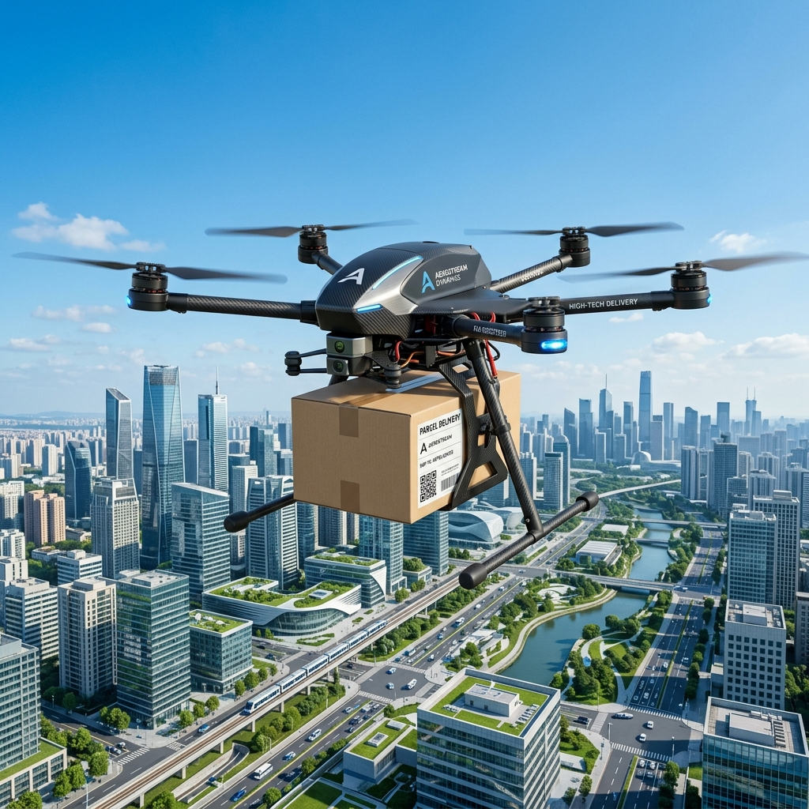
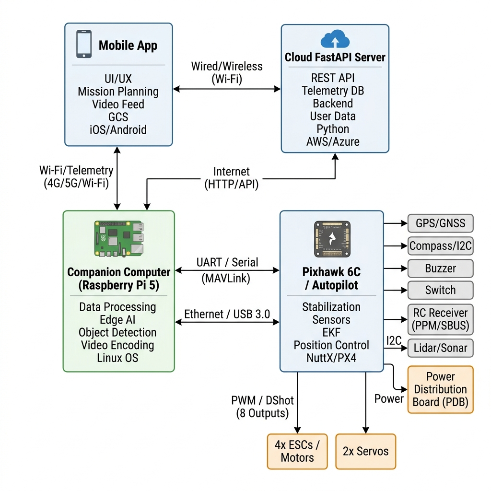
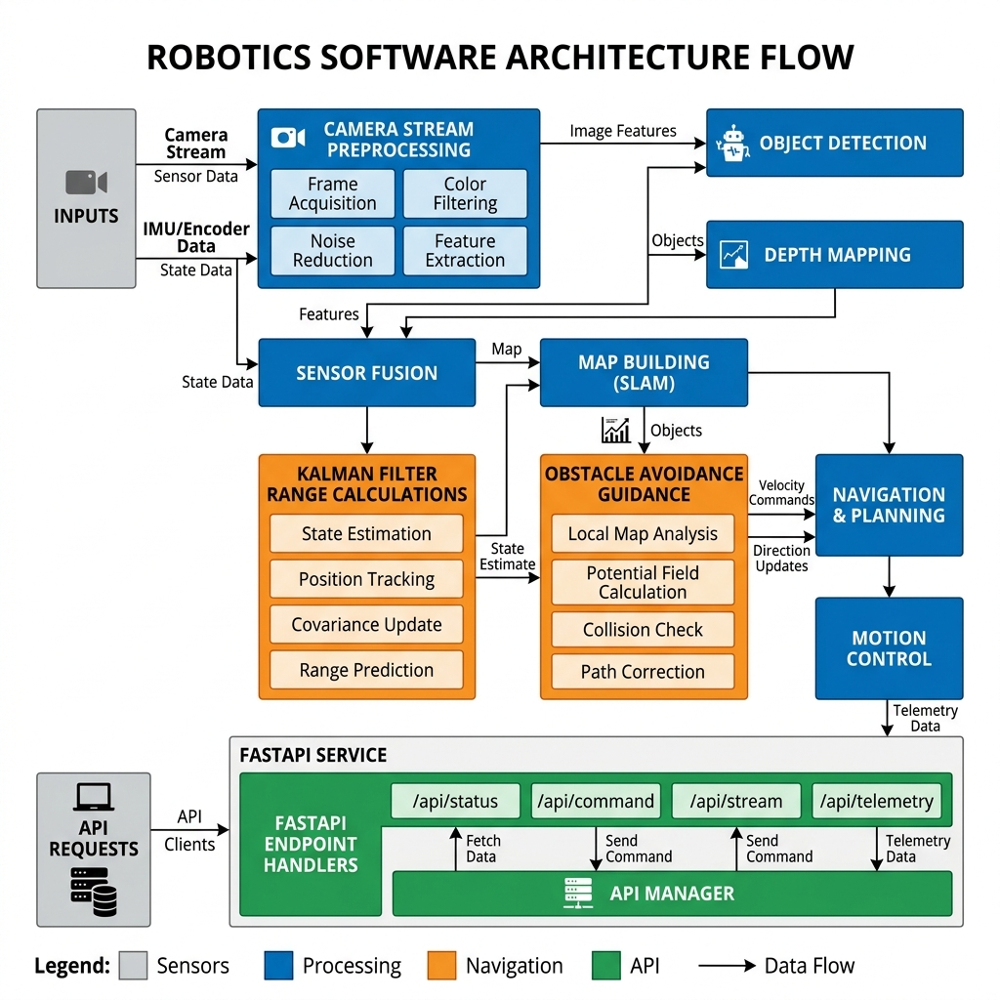
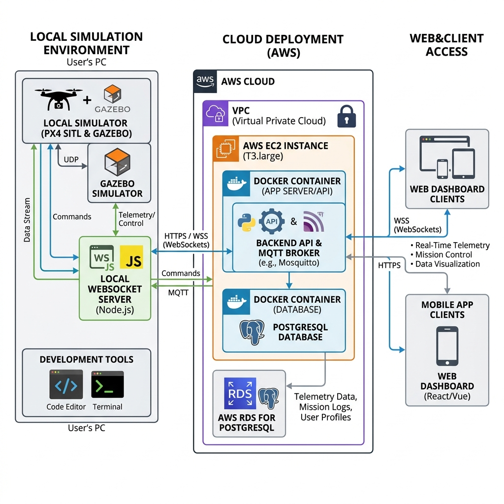
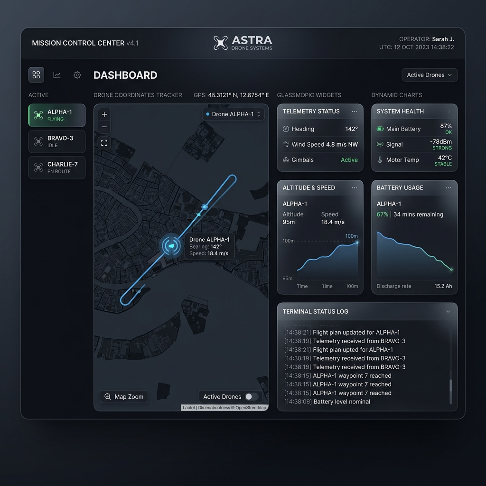
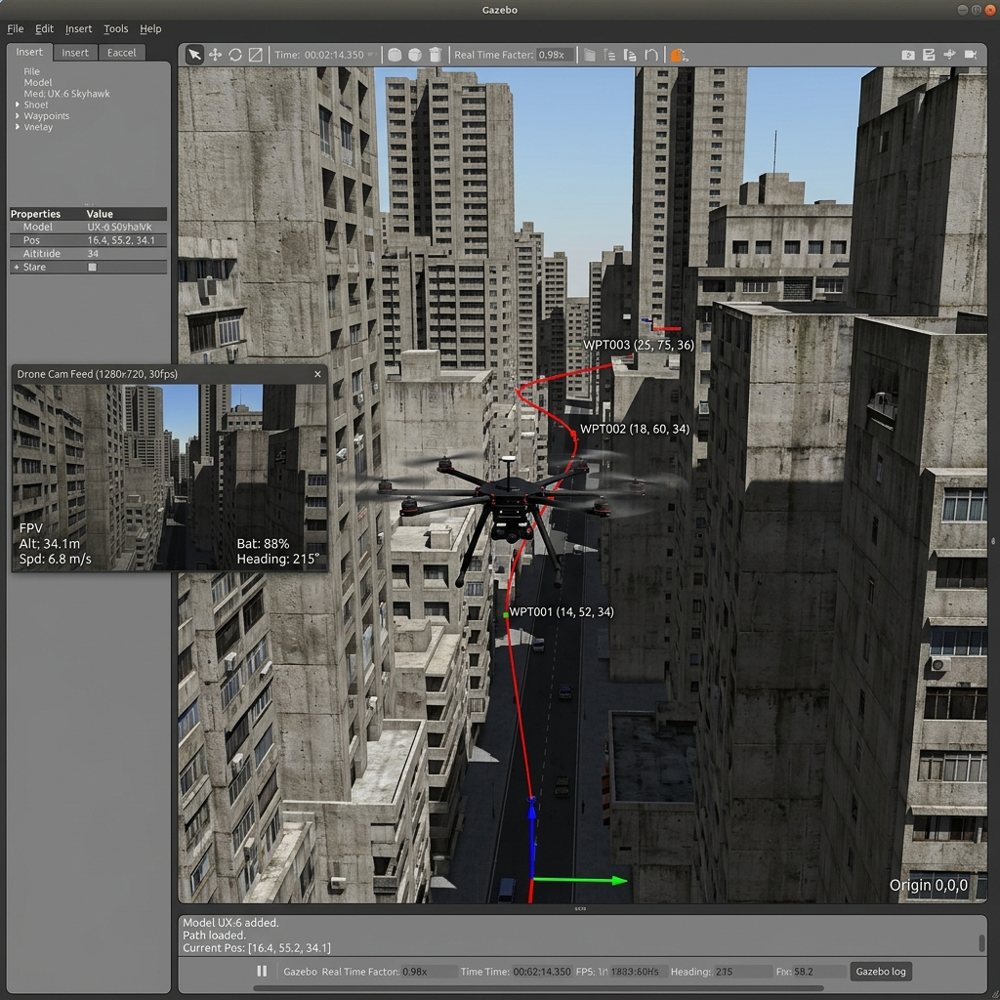

# 🛸 DAD — Direct Aerial Delivery
> **Research and Development Prototype — Simulation-Validated Architecture — Under Active Development**

[](#)
[](#)
[](#)
[](#)
[](#)




---

```text
Customer Order
      ↓
Mission Planner
      ↓
Route Optimiser
      ↓
PX4 Autopilot
      ↓
Sensor Fusion
      ↓
Obstacle Avoidance
      ↓
Telemetry Streaming
      ↓
FastAPI Backend
      ↓
Dashboard & Mobile App
```

---

## 📖 Project Brief
**Direct Aerial Delivery (DAD)** is a research and development platform for autonomous drone-based logistics and last-mile aerial delivery systems. Developed as an undergraduate final year B.E. engineering design project in Solapur, Maharashtra, India, the repository implements an integrated system-level R&D prototype bridging flight controller synchronization, monocular vision and single-axis LiDAR sensor fusion, real-time telemetry streaming, and automated failsafe logic.

---

## 💡 Why DAD Matters

Current delivery systems face challenges including:
- Traffic congestion
- Emergency medical supply delays
- Limited access to remote regions
- High last-mile delivery costs

DAD explores autonomous aerial logistics as a scalable solution through intelligent routing, sensor fusion, and real-time telemetry monitoring.

---

## 🧑💻 Engineering Contributions

DAD was developed to demonstrate end-to-end UAV systems engineering and autonomous logistics research.

### Key Contributions

- Designed the complete drone logistics architecture.
- Developed sensor fusion algorithms integrating LiDAR, camera, GPS, and IMU data.
- Implemented autonomous obstacle avoidance and weather-aware safety logic.
- Built PX4 and MAVLink communication modules.
- Developed FastAPI telemetry services and WebSocket streaming.
- Created simulation validation scenarios using PX4 SITL and Gazebo.
- Produced academic research documentation and IEEE publication drafts.

---

## 🛠️ Skills & Technologies Mapping

| Technical Area | Technology | Usage |
| :--- | :--- | :--- |
| **UAV Systems** | PX4, MAVLink | Flight Control |
| **AI & Perception** | OpenCV, YOLO | Obstacle Detection |
| **Sensor Fusion** | EKF, Kalman Filter | State Estimation |
| **Backend** | FastAPI, Python | Telemetry Services |
| **Databases** | SQLite, PostgreSQL | Mission Storage |
| **Cloud** | Docker, AWS ECS | Deployment |
| **Mobile** | React Native | Customer Application |
| **Dashboard** | HTML, CSS, JavaScript | Fleet Monitoring |
| **DevOps** | GitHub Actions | CI/CD |

---

## 🎓 Academic Deliverables

- Final Year Engineering Project
- IEEE Research Paper Draft
- Patent Documentation
- Simulation Validation Reports
- Hardware Validation Framework
- PX4 SITL Demonstrations

---

## 📹 Demo Video & Scenario Showcase
Reviewers, recruiters, and evaluators can find screen-recording video logs demonstrating the Software-in-the-Loop (SITL) simulations and telemetry dashboard under the [demo/](file:///C:/Users/mallu/.gemini/antigravity/scratch/DAD-Direct-Aerial-Delivery/demo/) folder:
*   [SITL Flight Demonstration Video](file:///C:/Users/mallu/.gemini/antigravity/scratch/DAD-Direct-Aerial-Delivery/demo/SITL_demo.mp4)
*   [Live Telemetry Dashboard Stream Video](file:///C:/Users/mallu/.gemini/antigravity/scratch/DAD-Direct-Aerial-Delivery/demo/telemetry_demo.mp4)
*   [AI Bird Avoidance Scenario Video](file:///C:/Users/mallu/.gemini/antigravity/scratch/DAD-Direct-Aerial-Delivery/demo/bird_avoidance_demo.mp4)
*   [Low Battery RTL Trigger Video](file:///C:/Users/mallu/.gemini/antigravity/scratch/DAD-Direct-Aerial-Delivery/demo/low_battery_demo.mp4)
*   [Emergency Weather Abort Video](file:///C:/Users/mallu/.gemini/antigravity/scratch/DAD-Direct-Aerial-Delivery/demo/emergency_landing_demo.mp4)

*For recording formats and configurations, see the [Video Recording Guide](file:///C:/Users/mallu/.gemini/antigravity/scratch/DAD-Direct-Aerial-Delivery/demo/recording_guide.md).*

---

## 📊 Performance Metrics (Simulation Benchmarks)
Metrics and latency parameters are captured from simulated validation runs. Target and expected metrics are logged clearly to maintain data integrity:
*   [Sensor Fusion Benchmark](file:///C:/Users/mallu/.gemini/antigravity/scratch/DAD-Direct-Aerial-Delivery/benchmark_reports/sensor_fusion_benchmark.md): EKF processing latency ($0.8$ ms) and obstacle detection reaction limits.
*   [Backend Latency Report](file:///C:/Users/mallu/.gemini/antigravity/scratch/DAD-Direct-Aerial-Delivery/benchmark_reports/backend_latency_report.md): API endpoint response times and database commits.
*   [Telemetry Throughput Report](file:///C:/Users/mallu/.gemini/antigravity/scratch/DAD-Direct-Aerial-Delivery/benchmark_reports/telemetry_throughput.md): Packet size comparisons (JSON vs Protobuf) and network jitter packet dropouts.
*   [Navigation Accuracy Report](file:///C:/Users/mallu/.gemini/antigravity/scratch/DAD-Direct-Aerial-Delivery/benchmark_reports/navigation_accuracy.md): Cross-track error under wind gusts, battery discharge prediction margins, and landing deviation.

---

## 🛠️ Hardware Stack & Bring-Up SOP
The physical system is modeled around the Tarot 680Pro hexacopter chassis. Standard operating procedures (SOPs) for hardware assembly and bench validation are placed under the [hardware/](file:///C:/Users/mallu/.gemini/antigravity/scratch/DAD-Direct-Aerial-Delivery/hardware/) and [hardware_validation/](file:///C:/Users/mallu/.gemini/antigravity/scratch/DAD-Direct-Aerial-Delivery/hardware_validation/) folders:
*   [Bill of Materials (BOM)](file:///C:/Users/mallu/.gemini/antigravity/scratch/DAD-Direct-Aerial-Delivery/hardware/BOM.md): Complete list with components (Pixhawk 6C, Pi 5, TFmini-S LiDAR, dual RTK GPS, etc.) and pricing in INR and USD.
*   [Assembly Guide](file:///C:/Users/mallu/.gemini/antigravity/scratch/DAD-Direct-Aerial-Delivery/hardware/assembly_guide.md): Carbon frame locking, ESC soldering, and companion computer wiring.
*   [Calibration & Testing Logs](file:///C:/Users/mallu/.gemini/antigravity/scratch/DAD-Direct-Aerial-Delivery/hardware_validation/): Sensor, GPS accuracy, battery power load, and radio signal validation.
*   [Pre-Flight Checklist](file:///C:/Users/mallu/.gemini/antigravity/scratch/DAD-Direct-Aerial-Delivery/hardware_validation/flight_checklist.md): Mandatory ground checking checklist.
*   [Flight Readiness Report](file:///C:/Users/mallu/.gemini/antigravity/scratch/DAD-Direct-Aerial-Delivery/hardware_validation/flight_readiness_report.md): Final sign-off requirements prior to live testing.

---

## 📡 System Architecture
The platform integrates six primary functional layers:
1.  **Drone Autopilot**: Holybro Pixhawk 6C running PX4 stable firmware.
2.  **Companion Computer**: Raspberry Pi 5 executing YOLO object detection and sensor EKF.
3.  **MAVLink Bridge**: Python broker (`autonomous/px4_mavlink_bridge.py`) for waypoint syncing and status reading.
4.  **Backend Ingestion**: FastAPI microservices supporting WebSockets and database commits.
5.  **Control Room Dashboard**: Dark-mode Leaflet telemetry interface displaying paths and status.
6.  **Redundant Telemetry**: Dual-link 4G/LTE cellular link and 915MHz Holybro radio.

*Architecture diagrams are stored in the [architecture/](file:///C:/Users/mallu/.gemini/antigravity/scratch/DAD-Direct-Aerial-Delivery/architecture/) folder.*

---

## 🧪 Validation Results
Run outcomes and transaction dumps from the software-in-the-loop (SITL) tests:
*   [SITL Boot Logs](file:///C:/Users/mallu/.gemini/antigravity/scratch/DAD-Direct-Aerial-Delivery/validation/sitl_logs/): Console initialization and PX4 parameters.
*   [MAVLink Transaction Logs](file:///C:/Users/mallu/.gemini/antigravity/scratch/DAD-Direct-Aerial-Delivery/validation/mavlink_logs/): Waypoint upload ACK packets.
*   [Telemetry captures](file:///C:/Users/mallu/.gemini/antigravity/scratch/DAD-Direct-Aerial-Delivery/validation/telemetry_captures/): WebSocket JSON packet capture examples.
*   [Mission Reports Matrix](file:///C:/Users/mallu/.gemini/antigravity/scratch/DAD-Direct-Aerial-Delivery/validation/mission_reports/): Summarized test cases (low battery, rain aborts, bird avoidance).

---

## 📚 Research Outputs & Patents
Whitepapers detailing the mathematical, algorithmic, and regulatory underpinnings:
*   [Literature Review](file:///C:/Users/mallu/.gemini/antigravity/scratch/DAD-Direct-Aerial-Delivery/research/literature_review.md): Literature review on 3D path planning and state estimation.
*   [DGCA Compliance](file:///C:/Users/mallu/.gemini/antigravity/scratch/DAD-Direct-Aerial-Delivery/research/dgca_compliance.md): Regulatory compliance under Indian Drone Rules (UIN, geofencing, NPNT).
*   [Sensor Fusion Analysis](file:///C:/Users/mallu/.gemini/antigravity/scratch/DAD-Direct-Aerial-Delivery/research/sensor_fusion_analysis.md): Coordinate projections and EKF Jacobian formulations.
*   [Risk Assessment Matrix](file:///C:/Users/mallu/.gemini/antigravity/scratch/DAD-Direct-Aerial-Delivery/research/risk_assessment.md): Threat mitigation mapping.
*   **Patent Intellectual Property Notebook**: Preliminary invention disclosures, novel claims, and claim drafts are archived in the [patent/](file:///C:/Users/mallu/.gemini/antigravity/scratch/DAD-Direct-Aerial-Delivery/patent/) folder for final reviews.

---

## 📊 Repository Statistics

*   **Total Source Files**: 214
*   **Validation Tests**: 21 (All passing)
*   **System Architectures**: 3 (.png & .mermaid)
*   **Simulation Scenarios**: 5 (SITL verified)
*   **Research Papers**: 4 (Indian English drafts)
*   **Patent IP Notes**: 4 (Invention disclosure & claims)
*   **CI/CD Pipelines**: 2 (CI build and ECR/ECS CD templates)

---

## 📸 Professional Portfolio Visual Showcase

### 📡 System Architecture Design
The high-level R&D system layout mapping companion and autopilot tasks:


### 💻 Software Component Architecture
The module blocks, state trackers, and API routes within the ecosystem:


### ☁️ Cloud Deployment Architecture
AWS container clustering, RDS database nodes, and ingress configurations:


### 📊 Control Room Dashboard Interface
The telemetry dashboard displaying real-time coordinates, battery decays, and geofence warnings:


### 🛸 Hexacopter Simulation Environment
The 3D Gazebo simulator rendering the Tarot 680Pro drone in urban micro-airspace:


---

## ⚙️ Quick Start

### 1. Backend Ingestion Server
```bash
pip install -r requirements.txt
python -m uvicorn backend.main:app --reload
```
*API docs dashboard: `http://localhost:8000/docs`*

### 2. Telemetry Listeners & Bridges
```bash
python autonomous/px4_mavlink_bridge.py
python backend/telemetry/px4_listener.py
```

### 3. Verify Test Suite
```bash
python testing/test_suite.py
```

---

## 📖 Citation

If you use this project for academic research, final-year projects, or technical references, please cite:

```bibtex
@thesis{DAD_Drone_2026,
  author = {Mallu Diswardhan Reddy},
  title = {Direct Aerial Delivery (DAD): Autonomous Drone Logistics and Last-Mile Delivery Ecosystem},
  school = {Department of Electronics and Communication Engineering},
  year = {2026},
  type = {Final Year Engineering Project}
}
```

---

## 🗺️ Roadmap

### Phase 1 – Research & Architecture
* Literature survey on autonomous drone logistics
* DGCA compliance and NPNT framework study
* System architecture design
* Hardware platform selection

### Phase 2 – Simulation & Sensor Fusion
* Multi-Sensor Fusion State Estimation (EKF/Kalman Filter)
* LiDAR + Camera obstacle detection
* Weather-aware flight safety monitoring
* Battery prediction and Return-to-Launch algorithms

### Phase 3 – Autonomous Flight Intelligence
* Dynamic route planning and obstacle avoidance
* Bird, wire, pole, tree, and building avoidance
* Emergency landing decision engine
* Weather risk assessment module

### Phase 4 – Telemetry & Cloud Platform
* PX4 + MAVLink integration
* FastAPI telemetry backend
* MQTT and WebSocket communication
* Fleet monitoring dashboard

### Phase 5 – Hardware Validation
* Tarot 680 Pro assembly
* Pixhawk 6C integration
* Raspberry Pi 5 companion computer deployment
* GPS, LiDAR, and telemetry calibration

### Phase 6 – Field Trials
* Ground testing and validation
* Autonomous waypoint missions
* Obstacle avoidance validation
* Emergency response testing

### Phase 7 – Smart City Integration
* Multi-drone fleet management
* High-bandwidth 5G telemetry integration
* Delivery hub optimisation
* Smart-city aerial logistics deployment

---

## 📚 Research & Innovation
The research and technical foundations of DAD are documented throughout the repository.

### Research Papers
* Literature Review – `research/literature_review.md`
* Sensor Fusion Analysis – `research/sensor_fusion_analysis.md`
* DGCA Compliance Study – `research/dgca_compliance.md`
* Risk Assessment Framework – `research/risk_assessment.md`

### Intellectual Property Documentation
* Invention Disclosure – `patent/invention_disclosure.md`
* Novelty Analysis – `patent/novelty_analysis.md`
* Prior Art Review – `patent/prior_art_review.md`
* Draft Claims – `patent/claim_drafts.md`

---

## 🤝 Contributions
Contributions from students, researchers, drone engineers, robotics developers, and aviation professionals are welcome.

1. Fork the repository.
2. Create a feature branch:
   ```bash
   git checkout -b feature/NewFeature
   ```
3. Follow PEP-8 and project coding standards.
4. Commit changes:
   ```bash
   git commit -m "Add NewFeature"
   ```
5. Push your branch and create a Pull Request.

---

## 👨💻 Author

**Mallu Diswardhan Reddy**

Electronics and Communication Engineering Student

Areas of Interest:
- UAV Systems
- Drone Logistics
- Sensor Fusion
- Autonomous Navigation
- Computer Vision
- Embedded Systems

GitHub: [https://github.com/438malludiswardhanreddy-sketch](https://github.com/438malludiswardhanreddy-sketch)

---

## ⚖️ Intellectual Property Notice
This repository contains research concepts, autonomous flight algorithms, sensor fusion methodologies, safety frameworks, and drone logistics architectures developed as part of the Direct Aerial Delivery (DAD) research initiative.

The source code is distributed under the MIT Licence. Certain concepts, system architectures, autonomous safety mechanisms, and logistics optimisation methodologies may be subject to future intellectual property protection and patent filings.

---

## 📄 Licence
This project is licensed under the MIT Licence. See the [LICENSE](LICENSE) file for details.

---

### 🚁 Building the Future of Safe, Intelligent, and Sustainable Aerial Logistics
